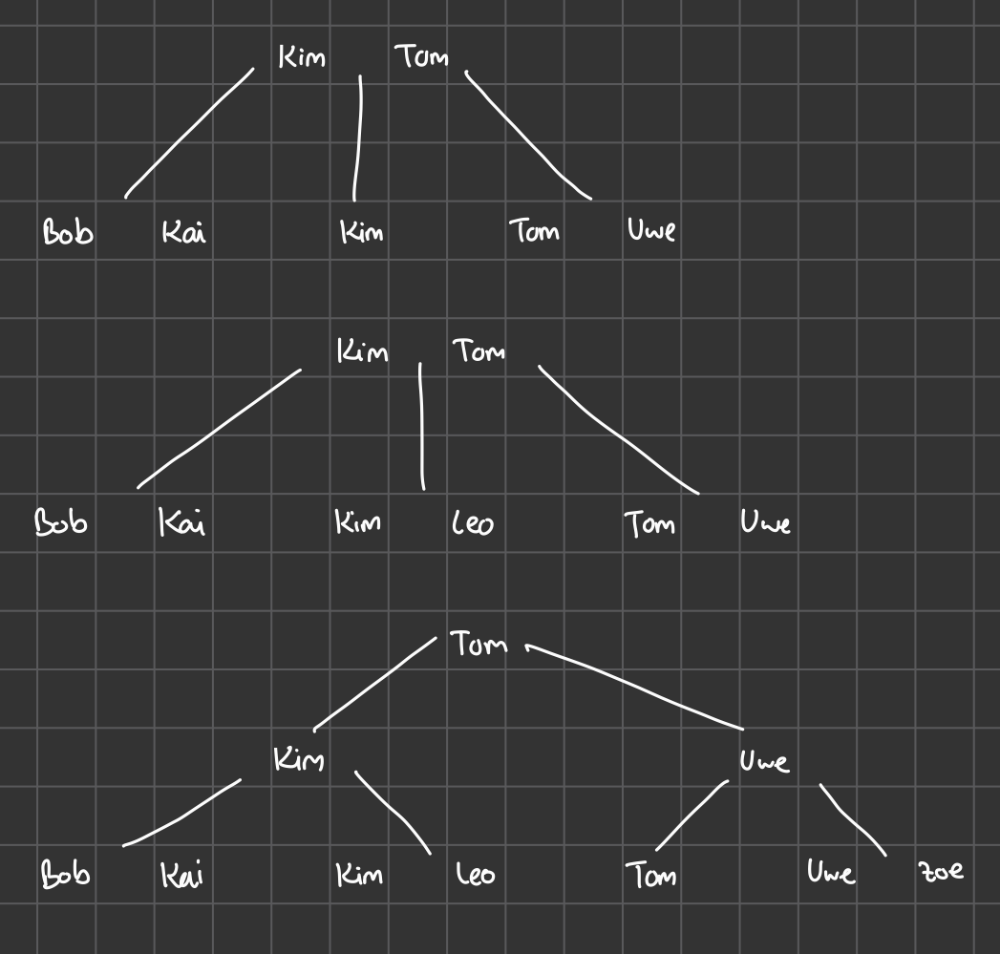

# Übung 12

## Aufgabe 1

### 1.



### 2.

```
1
2
5
6
9
3
4
10
13
7
8
14
17
11
12
18
19
15
16
20
```

## Aufgabe 2

```sql
CREATE TABLE personen (
  pid SERIAL PRIMARY KEY,
  name VARCHAR(1024),
  alter INT
);

CREATE TABLE freundschaften (
  pid1 INT REFERENCES personen(pid),
  pid2 INT REFERENCES personen(pid),
  PRIMARY KEY (pid1, pid2)
);


CREATE OR REPLACE FUNCTION freundschaft_duplizieren() RETURNS TRIGGER AS $$
BEGIN
  IF NOT EXISTS (SELECT 1 FROM freundschaften F WHERE f.pid1=NEW.pid2 AND f.pid2=NEW.pid1) THEN
  	INSERT INTO freundschaften VALUES (NEW.pid2, NEW.pid1);
  END IF;
  RETURN NEW;
END;
$$ LANGUAGE plpgsql;

CREATE TRIGGER freundschaft_duplizieren_trigger
AFTER INSERT ON freundschaften
FOR EACH ROW
EXECUTE FUNCTION freundschaft_duplizieren();


INSERT INTO personen (name, alter) VALUES
('Alice', 25),
('Bob', 30),
('Charlie', 35),
('Diana', 28),
('Eve', 40);

INSERT INTO freundschaften (pid1, pid2) VALUES
(1, 2),  -- Alice and Bob
(2, 3),  -- Bob and Charlie
(3, 4),  -- Charlie and Diana
(4, 5),  -- Diana and Eve
(1, 3),  -- Alice and Charlie
(2, 4);  -- Bob and Diana
```
