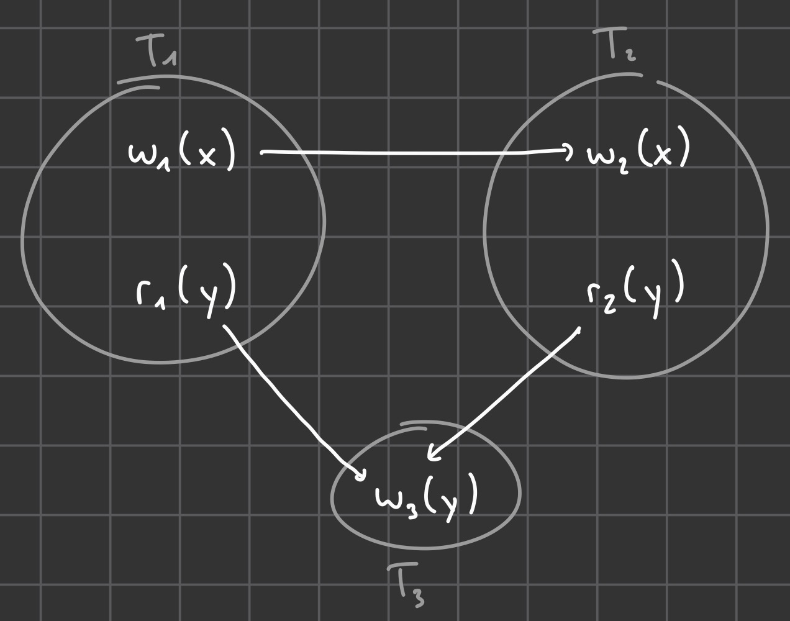

# Übung 9

## Aufgabe 1

### a.

1. Richtig
2. Falsch
3. Falsch (Konsistent)
4. Falsch (Dirty Read)
5. Falsch

### b.

Es gibt keinen Zyklus.

### c.

TA2 muss warten, bis TA1 fertig ist, da TA1 das Exclusive Lock auf x hält.
-> Richtig